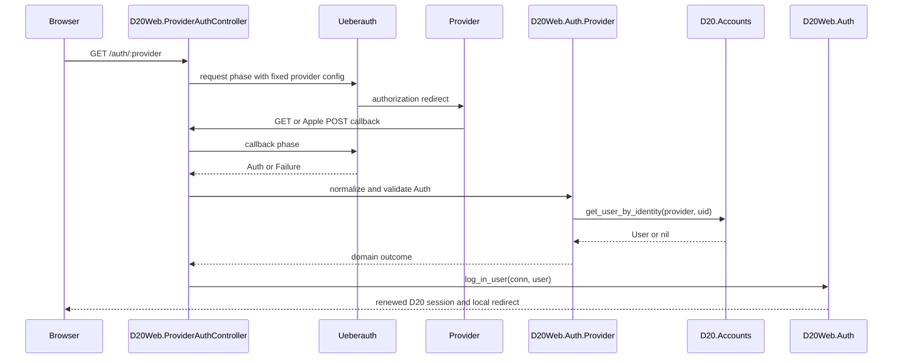

# External Provider Authentication with Ueberauth

Status: accepted architecture and implemented persistence foundation

Tracking: [#203](https://github.com/ravecat/d20/issues/203)

Provider issues: [Google #190](https://github.com/ravecat/d20/issues/190), [Discord #188](https://github.com/ravecat/d20/issues/188), [Apple #191](https://github.com/ravecat/d20/issues/191), [Facebook #187](https://github.com/ravecat/d20/issues/187)

Reviewed: 2026-08-10

## Decision

D20 will use Ueberauth as the web-boundary framework for external provider authentication. D20 Accounts remains the identity system of record, and `D20Web.Auth` remains responsible for D20 sessions.

This is a conditional selection, not a claim that every Ueberauth provider strategy is equally current. The Ueberauth core API is established and widely used, but the Google, Discord, Facebook, and Apple strategies have independent release and security histories. Each strategy must pass a compatibility and protocol-security spike before its provider is enabled.

Assent is a credible and currently better integrated alternative. It ships Google, Discord, Facebook, and Apple strategies in one package, supports OIDC, and exposes optional PKCE parameters. It was not selected because the current product decision is to standardize on Ueberauth and its Plug callback model. Revisit Assent before provider implementation if the Facebook or Discord spikes fail, or if uniform OIDC and PKCE support becomes a release requirement.

Sources: [Ueberauth 0.10.8](https://hex.pm/packages/ueberauth), [Ueberauth strategy lifecycle](https://hexdocs.pm/ueberauth/Ueberauth.Strategy.html), [Assent 0.3.1](https://hex.pm/packages/assent), [Assent OAuth2 and PKCE options](https://hexdocs.pm/assent/Assent.Strategy.OAuth2.html).

## Purpose

Provider authentication answers one question for D20: which local user does this provider account identify?

Ueberauth does not replace the local account or session system. It performs the provider request and callback phases and exposes either `Ueberauth.Auth` or `Ueberauth.Failure` on the Plug connection. After that, D20 must:

1. Normalize the provider result into trusted, minimal primitives.
2. Resolve the exact `(provider, provider_uid)` identity through `D20.Accounts`.
3. Apply D20 account creation or linking policy when no identity exists.
4. Create and rotate the normal D20 session through `D20Web.Auth.log_in_user/3`.

Local email/password and magic-link authentication remain peer authentication methods. They are not implemented through Ueberauth and continue to end in the same D20 user and session model.

## Current D20 Boundaries

- [`D20.Accounts`](../../lib/d20/accounts.ex) owns user lookup, registration, authentication data, session tokens, and the new external identity operations.
- [`D20.Accounts.User`](../../lib/d20/accounts/user.ex) is the local account and actor identity. Its email is currently required, so provider-only registration still depends on the username/account foundation in #192.
- [`D20.Accounts.UserIdentity`](../../lib/d20/accounts/user_identity.ex) stores only the provider identity mapping introduced by this work.
- [`D20Web.Auth`](../../lib/d20_web/auth.ex) owns local session renewal, fixation protection, redirects, and the current-user scope.
- [`D20Web.Router`](../../lib/d20_web/router.ex) has separate Inertia and browser pipelines. Provider redirects must be normal browser navigations, not Inertia requests.
- [`D20Web.Endpoint`](../../lib/d20_web/endpoint.ex) configures the signed `_d20_key` session cookie with `SameSite=Lax`.

The matching OpenSpec change records the implemented contract: [`establish-external-provider-identity-foundation`](../../openspec/changes/establish-external-provider-identity-foundation/).

## Implemented Persistence Foundation

The first integration slice is provider-library independent:

```text
user_identities
  id            identity-prefixed TypeID string primary key
  user_id       TypeID string foreign key -> users.id, ON DELETE CASCADE
  provider      google | facebook | apple | discord
  provider_uid  opaque, case-sensitive string, maximum 255 characters
  inserted_at
  updated_at
```

Database invariants:

- Unique `(provider, provider_uid)` - an external account has one D20 owner.
- Unique `(user_id, provider)` - a D20 user has at most one account for each provider.
- Provider check constraint - unsupported or misspelled providers fail closed.
- Cascading foreign key - deleting a D20 user deletes its unusable identity mappings.

The table intentionally has no email, display name, avatar, access token, refresh token, ID token, or raw provider payload. Provider claims are transient callback input, not authoritative account state.

Public context operations:

- `Accounts.link_user_identity(user, provider, provider_uid)`
- `Accounts.list_user_identities(user)`
- `Accounts.get_user_by_identity(provider, provider_uid)`

These functions accept D20 primitives, not `Ueberauth.Auth`. A future adapter is the only code that should understand provider-specific payloads.

## Target Web Integration



### Proposed modules

| Boundary | Responsibility |
| --- | --- |
| `D20Web.Auth.<Provider>Controller` | Start provider navigation, receive callbacks, map outcomes to flash/prompt/redirect, and call `Auth` only after Accounts returns a D20 user. |
| `D20Web.Auth.<Provider>` | Allowlist one provider, normalize `Ueberauth.Auth`, extract the stable UID, interpret provider-specific email verification, and reject incomplete or unexpected payloads. |
| `D20.Accounts` | Resolve and link external identities, enforce account rules, and remain unaware of Ueberauth structs and provider tokens. |
| `D20Web.Auth` | Create or renew the D20 session and preserve its existing fixation protection. |

Do not add `Ueberauth.Auth` handling to `D20.Accounts`. Do not put provider decisions into Svelte. The browser UI only starts a full-page navigation and renders server-provided availability and errors.

## Identity and Account Policy

The provider UID is authoritative for provider identity. Email is not an identity key. Google explicitly warns that email can change and that `sub` must be used as the stable account identifier. The same rule applies across providers: normalize the strategy's stable UID and store it with the provider name.

Callback outcomes:

| State | Outcome |
| --- | --- |
| Exact identity exists | Log in the owning D20 user through `Auth.log_in_user/3`. |
| Identity is unknown and visitor is signed out | Start an explicit account completion or provider-registration flow. Do not silently attach by matching email. |
| Identity is unknown and an authenticated user explicitly started linking | Link only after the required recent-authentication proof and conflict checks. |
| Identity belongs to another user | Return a generic conflict result without revealing the other account. |
| Provider callback is invalid or incomplete | Fail without creating a D20 session or identity row. |

Provider email can help prefill a later account form only after provider-specific verification has succeeded. `Ueberauth.Auth.Info` has no generic email-verification field, so `D20Web.ProviderAuth` must interpret verified claims from each strategy's raw response. Apple 0.7.0 derives its stable UID and optional email from ID-token claims and can merge a first-callback name payload, but it exposes no generic verified-email flag. That behavior must be tested rather than inferred from the shared Ueberauth struct.

Sources: [Ueberauth Auth type](https://hexdocs.pm/ueberauth/Ueberauth.Auth.html), [Ueberauth Auth.Info fields](https://hexdocs.pm/ueberauth/Ueberauth.Auth.Info.html), [Google stable `sub` guidance](https://developers.google.com/identity/openid-connect/openid-connect), [Apple 0.7.0 strategy source](https://github.com/ueberauth/ueberauth_apple/blob/0.7.0/lib/ueberauth/strategy/apple.ex).

## Strategy Maturity Snapshot

This snapshot must be refreshed when provider work begins.

| Package | Current version on 2026-08-10 | Assessment and gate |
| --- | --- | --- |
| `ueberauth` | 0.10.8, 2024-02-27 | Core callback contract and built-in `state` CSRF handling are established. Release cadence is slow, so pin the version and audit changes before upgrade. |
| `ueberauth_google` | 0.12.1, 2023-11-14 | Reasonable first provider, but verify current Google endpoints, requested scopes, UID mapping, callback errors, and PKCE behavior in an integration spike. |
| `ueberauth_discord` | 0.7.0, 2022-02-01 | Old and maintained outside the Ueberauth Hex publisher. Verify current Discord API compatibility, UID and verified-email extraction, and error handling before adoption. |
| `ueberauth_facebook` | 0.10.0, 2022-05-05 | High-risk compatibility gate. The released source still defaults the token endpoint to Graph API `/v2.8/oauth/access_token`. Prove a supported versioned endpoint override and complete end-to-end flow before adding the dependency. |
| `ueberauth_apple` | 0.7.0, 2026-07-14 | Use 0.7.0 or at least 0.6.2. Versions before 0.6.2 have a critical missing ID-token claim-validation advisory. Version 0.7.0 contains the required callback state/nonce behavior described below. |

This evidence supports "usable with provider-specific gates", not "uniformly mature". Assent 0.3.1 was released in 2025 and bundles all four providers, so it remains the fallback if maintaining several old Ueberauth strategies becomes more work than the Plug integration saves.

Sources: [Ueberauth versions](https://hex.pm/packages/ueberauth/versions), [Google versions](https://hex.pm/packages/ueberauth_google/versions), [Discord versions](https://hex.pm/packages/ueberauth_discord/versions), [Facebook versions](https://hex.pm/packages/ueberauth_facebook/versions), [Facebook OAuth source](https://github.com/ueberauth/ueberauth_facebook/blob/v0.10.0/lib/ueberauth/strategy/facebook/oauth.ex#L12-L18), [Apple versions and advisory](https://hex.pm/packages/ueberauth_apple/advisories), [Assent changelog](https://hexdocs.pm/assent/CHANGELOG.html).

## Callback and Cookie Strategy

Ueberauth core uses a provider request phase and callback phase and assigns success or failure to the Plug connection. Its CSRF protection uses a `state` value stored in the `ueberauth.state_param` cookie. Do not disable `state` validation.

Apple is different:

- Requesting `name` or `email` requires `response_mode=form_post`.
- The callback must accept POST.
- Cross-site POST does not include D20's `SameSite=Lax` `_d20_key` session cookie.
- `ueberauth_apple` 0.7.0 changes its own state cookie to `SameSite=None; Secure` for `form_post` and reuses the state value as the OIDC nonce.

Therefore the Apple callback can validate the Ueberauth transaction, but it cannot rely on D20's normal session cookie for `return_to`, current user, or link intent. Do not weaken the global D20 session cookie to `SameSite=None`.

When Apple linking or account completion is implemented, add a separate short-lived, encrypted, HTTP-only provider-attempt cookie with `Secure` and the minimum SameSite policy needed by that provider. It should contain or reference only one-time transaction data such as action, safe local return path, and expected D20 user. Consume it once and validate its age and binding at callback. A server-side attempt record is an acceptable alternative if stronger replay control is needed.

Sources: [Apple web callback response modes](https://developer.apple.com/documentation/signinwithapple/incorporating-sign-in-with-apple-into-other-platforms), [Ueberauth Apple notes](https://github.com/ueberauth/ueberauth_apple), [Apple 0.7.0 state and nonce implementation](https://github.com/ueberauth/ueberauth_apple/blob/0.7.0/lib/ueberauth/strategy/apple.ex#L36-L100), [Ueberauth CSRF guidance](https://hexdocs.pm/ueberauth/Ueberauth.Strategy.html#module-cross-site-request-forgery).

## Routing and Navigation

Add explicit allowlisted routes rather than accepting arbitrary provider modules:

```text
GET  /auth/:provider
GET  /auth/:provider/callback
POST /auth/apple/callback
```

The exact path can change during implementation, but the route-to-provider mapping must be closed over `google`, `facebook`, `apple`, and `discord`.

Provider buttons must use normal links or `window.location`, because the response leaves D20 for another origin. Do not use an Inertia form submission for the provider request.

The Apple POST callback needs a narrowly scoped pipeline that parses URL-encoded input and runs Ueberauth state/nonce validation without Phoenix form-CSRF rejection. Do not remove `protect_from_forgery` from the existing Inertia or browser pipelines. GET callbacks can keep the normal browser protections.

Provider strategies can accept request parameters such as `scope`. The controller must not forward arbitrary query parameters. Use fixed server-side scopes and an explicit allowlist for any future parameters such as `prompt`.

## Security Requirements for Provider Implementation

- Use authorization code flows and exact registered HTTPS callback URLs.
- Keep Ueberauth `state` validation enabled. Verify OIDC nonce validation where applicable.
- Audit PKCE support for each strategy. OAuth 2.0 Security BCP recommends PKCE even for confidential web clients. If a strategy cannot meet the decided security baseline, wrap it safely, replace that strategy, or revisit Assent.
- Treat `(provider, provider_uid)` as the only provider identity key. Never auto-link on email.
- Fix scopes in server configuration and request the minimum needed for authentication and account completion.
- Never persist access tokens, refresh tokens, ID tokens, or raw claims for login-only providers.
- Never log or send full `Ueberauth.Auth`, `credentials`, or `extra.raw_info` structures to telemetry or error tracking. Log provider, outcome class, request ID, and internal error code only.
- Use `Auth.safe_local_path/2` for post-auth destinations. Never redirect to an unvalidated callback parameter.
- Rotate the D20 session through `Auth.log_in_user/3` after successful signed-out login.
- Return generic errors for unknown identity, provider rejection, duplicate ownership, and callback failure where detailed output could reveal accounts.
- Rate-limit request and callback abuse at the web boundary before public rollout.
- Run `mix hex.audit` and review transitive OAuth/JWT dependencies before each provider release.

OAuth source: [RFC 9700 - OAuth 2.0 Security Best Current Practice](https://www.rfc-editor.org/rfc/rfc9700.html).

## Configuration Plan

Later provider changes will need:

- Ueberauth core and one reviewed strategy dependency at a time in `mix.exs`.
- Static provider allowlist and non-secret options in `config/config.exs`.
- Runtime client IDs and secrets in `config/runtime.exs`.
- Documented variable names with empty values in `envs/.env.example`.
- Production startup validation only for providers that are intentionally enabled.
- Exact development and production callback URLs registered in each provider console.
- HTTPS for Apple callbacks and every production flow.

Do not read provider secrets at compile time. Do not check `.env` or Apple private keys into the repository. Apple client secrets expire and should be generated at runtime from protected key material or supplied through the deployment secret store.

## Testing Strategy

Shared controller and adapter tests:

- Supported provider request starts and unsupported provider fails closed.
- Success normalizes only provider, UID, and explicitly needed transient claims.
- `Ueberauth.Failure`, missing UID, malformed claims, and provider denial create no D20 identity or session.
- Existing identity logs in its owner and renews the local session.
- Unknown identity never silently merges by email.
- `return_to` accepts only safe local paths.
- Logs and telemetry contain no credentials or raw provider payloads.

Provider contract tests with captured, sanitized fixtures:

- Stable UID extraction and type normalization.
- Email presence and verification semantics.
- Minimum scopes and ignored request-supplied scope escalation.
- State, nonce, callback method, and PKCE behavior.
- Provider error and token endpoint error mapping.

Browser tests:

- Provider controls use full document navigation.
- Callback success returns to D20 with an authenticated local session.
- Cancel and error states return a usable account dialog.
- Apple POST succeeds without the `_d20_key` cookie and consumes the provider attempt exactly once.

Manual staging checks remain mandatory because provider consoles, redirect allowlists, consent screens, and review modes cannot be represented fully in local tests.

## Rollout Order

1. Persistence foundation - completed in #203.
2. Compatibility spikes - pin candidate versions, audit advisories, verify endpoints and PKCE, and record a go/no-go for each strategy.
3. Shared web boundary - add allowlisted routes, normalizer, callback outcome type, provider-attempt handling, safe redirects, redacted telemetry, and controller tests.
4. Google #190 - first end-to-end provider because its identity contract and current documentation are the clearest.
5. Discord #188 - proceed only after the older independent strategy passes its compatibility spike.
6. Apple #191 - add POST callback and isolated cross-site attempt handling, pinned to a fixed version.
7. Facebook #187 - proceed only after proving compatibility with a currently supported Graph API version; otherwise revisit Assent or a dedicated strategy.
8. Enable UI controls only after each provider passes local, staging, failure-path, and rollback validation.

## Deferred Decisions

These questions do not block the implemented database foundation but must be resolved before account linking or provider registration:

- What recent-authentication proof is required to link an additional identity?
- How does an unknown provider identity create a user while `User.email` is required?
- Which verified provider emails can prefill or confirm a D20 address, if any?
- What recovery proof is required to unlink the last usable authentication method?
- Is PKCE mandatory for every enabled provider, and does each selected strategy satisfy it?
- Does the product need one provider account per user, or should the current database invariant be relaxed before public linking?

## Conclusion

The correct first step is the provider-independent identity table and Accounts API now implemented under #203. It provides a stable seam for Ueberauth without committing D20's domain model to provider payloads or tokens.

The next step is not to add all provider buttons at once. It is to run strategy compatibility and security spikes, especially for Facebook, Discord, Apple version pinning, and PKCE. Only then should the shared Phoenix callback boundary and the first Google flow be implemented.
